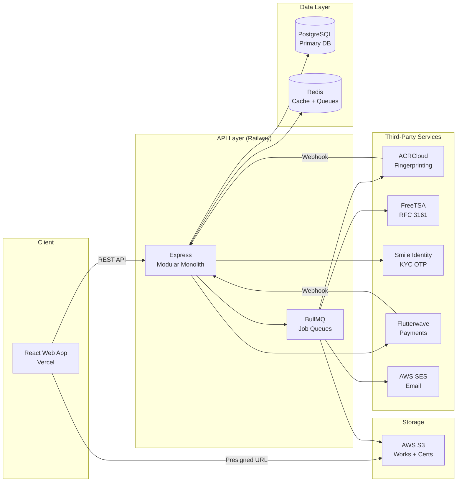

# HD Verse — PRD.md
## Product Requirements Document — MVP Sprint
**Version:** 1.0 | **Classification:** Internal | **June 2026**
**Author:** CTO (Eniola) | **Approver:** CEO (Metong Minwon)
**Sprint Duration:** 2–3 weeks
**Status:** Approved for build

---

## 1. Product Overview

### 1.1 What It Is

HD Verse is Africa's creative IP infrastructure — a platform that gives Nigerian music producers and micro-label owners timestamped, legally defensible proof of ownership for their work, before it is distributed anywhere.

### 1.2 Who It's For

**Primary persona (MVP):** Nigerian music producer or micro-label owner who:
- Has experienced beat theft, unauthorized use, or lost attribution
- Already uploads to DistroKid or Audiomack, and shares files via WhatsApp/Telegram
- Understands the pain of *"I cannot prove I made this"*
- Is emotionally primed to pay for protection

**Secondary personas (deferred):**
- Filmmaker / visual artist → Phase 2
- Label / publisher (bulk, enterprise) → Phase 2B

### 1.3 Why It Matters

African creators collect less than 2% of global music royalties despite producing some of the fastest-growing creative output in the world. The existing protection infrastructure — NCC registration, MCSN/CMO monitoring, distribution platforms — is fragmented, slow, corrupt, or built for other markets.

HD Verse fills a specific gap: **NCC-grade ownership proof, issued in 60 seconds, before distribution.** No existing tool does this for the African creator at this speed and price point.

Additionally, generative AI is actively scraping African sounds without attribution or payment — a growing, unaddressed threat the HD Verse certificate directly counters.

### 1.4 North Star Metric

> First paying creator who uploads more than once and refers someone else.

### 1.5 Sprint Success Criteria

| Metric | Target |
|--------|--------|
| Paying creators | 5–20 by end of Week 3 |
| Repeat uploads | ≥1 creator uploads 2+ works |
| Detection test | ≥1 match detected and alerted |
| Certificate shares | ≥1 certificate screenshot shared organically |
| Subscription waitlist | ≥10 emails captured via Basic/Pro "Coming Soon" |

---

## 2. Core User Stories

### Epic 1 — Account Creation

---

**US-01: Register an account**

> As a Nigerian music producer, I want to create an HD Verse account so that I can start registering my works.

**Acceptance Criteria:**
```
Given I am on the registration page
When I enter my full name, email, password, and Nigerian phone number
And I submit the form
Then my account is created
And I am prompted to verify my phone number via OTP
And I cannot proceed to upload until OTP verification is complete

Given I enter an email that already exists
When I submit the form
Then I see "An account with this email already exists. Sign in instead."
And no duplicate account is created

Given I enter a password shorter than 8 characters
Then I see an inline error before I can submit
```

---

**US-02: Verify phone number (KYC Tier 1)**

> As a new user, I want to verify my phone number via OTP so that my account is KYC-cleared before I make any payment.

**Acceptance Criteria:**
```
Given I have registered successfully
When the OTP screen appears
Then a 6-digit OTP is sent to my phone via Smile Identity
And I have 10 minutes to enter it before it expires

Given I enter the correct OTP
Then my phone is marked verified (kycStatus = VERIFIED)
And I am redirected to my dashboard

Given I enter an incorrect OTP
Then I see "Incorrect code. X attempts remaining."
And after 3 failed attempts, the OTP is invalidated
And I must request a new code

Given I request a resend
Then I must wait 60 seconds before requesting again
```

---

**US-03: Sign in**

> As a returning user, I want to sign in to access my registered works and certificates.

**Acceptance Criteria:**
```
Given I enter correct credentials
Then I receive an access token (15min) and refresh token (7 days)
Stored in httpOnly cookies

Given I enter incorrect credentials
Then I see "Invalid email or password." (no specificity on which is wrong)
And the attempt is rate-limited after 5 failures in 1 minute

Given my access token expires
When I make an authenticated request
Then the client automatically refreshes using the refresh token
Without requiring me to log in again
```

---

### Epic 2 — Work Registration

---

**US-04: Upload an audio file**

> As a verified producer, I want to upload my beat or track so that HD Verse can register my ownership.

**Acceptance Criteria:**
```
Given I am on the "Register a Work" screen
When I drop or select an audio file (MP3, WAV, AIFF)
Then the file is uploaded directly to S3 via presigned URL
And I see an upload progress indicator

Given the file exceeds 500MB
Then I see "File too large. Maximum size is 500MB."
And the upload does not proceed

Given I upload a file with the same SHA-256 hash as a previously registered work
Then I see "This exact file has already been registered."
And the upload is rejected with the existing certificate referenced

Given the upload completes
Then I am taken to Step 2 (metadata form)
```

---

**US-05: Enter work metadata**

> As a producer, I want to enter details about my work so the certificate is accurate and legally useful.

**Acceptance Criteria:**
```
Given I am on the metadata step
Then I must enter:
  - Work title (required)
  - Artist / producer name (required, pre-filled from my account)
  - Genre (optional)
  - Year of creation (optional)
  - Co-creators (optional, free text)

Given I omit a required field
Then I see an inline validation error on that field
And I cannot proceed to the review step

Given I complete all required fields and click Continue
Then I see the Review & Pay screen with a summary of my work and fees
```

---

**US-06: Review and pay for a certificate**

> As a producer, I want to review my submission and pay the certificate fee before my ownership is registered.

**Acceptance Criteria:**
```
Given I am on the Review & Pay screen
Then I see:
  - File name
  - Work title and artist
  - SHA-256 hash (first 20 characters + "...")
  - Certificate fee: $2.00 (or configured amount)
  - "ISRC Assignment: Included"
  - "Detection Registration: Included"
  - Total

Given I click "Pay $2 & Get Certificate"
Then I am redirected to Flutterwave checkout
With the amount and reference pre-filled

Given payment is completed successfully
Then Flutterwave sends a webhook to /api/payments/webhook
And the certificate pipeline is triggered
And I am redirected to the certificate issuance screen

Given payment fails or is cancelled
Then I am returned to the Review & Pay screen
And I see "Payment was not completed. Try again."
And my work record is preserved so I can retry payment
```

---

### Epic 3 — Certificate Issuance

---

**US-07: Receive an ownership certificate**

> As a producer who has paid, I want to receive my certificate immediately so I can prove my ownership right now.

**Acceptance Criteria:**
```
Given payment is confirmed
When the certificate pipeline completes (target: under 60 seconds)
Then I see the certificate issuance ceremony screen (animation)
And my certificate is displayed with:
  - Certificate number (HDV-2026-XXXXXX)
  - Work title
  - Creator name
  - ISRC
  - Registration date and time (UTC)
  - SHA-256 hash (truncated)
  - RFC 3161 Timestamp: Verified
  - "Compatible with Nigerian Copyright Commission framework"
  - QR code linking to the public verification URL

Given I click "Download PDF"
Then a PDF matching the DESIGN.md certificate specification is downloaded
With full gradient treatment preserved
And all metadata present and accurate

Given I click "Share Certificate"
Then the public verification URL is copied to clipboard
Or the native share sheet opens on mobile
```

---

**US-08: View and re-download past certificates**

> As a returning user, I want to access my certificates at any time from my dashboard.

**Acceptance Criteria:**
```
Given I am on the "My Works" screen
When I click on a registered work
Then I see the work detail with certificate status
And a "Download Certificate" button if status is ACTIVE

Given the signed S3 URL has expired (>7 days)
When I request a download
Then a new signed URL is generated on demand
And the download begins immediately
```

---

### Epic 4 — Detection & Alerts

---

**US-09: My work is fingerprinted for detection**

> As a producer, I want my registered work to be fingerprinted so HD Verse can detect unauthorized use.

**Acceptance Criteria:**
```
Given my certificate has been issued
Then my audio file is submitted to ACRCloud for fingerprinting
And the fingerprint ID is stored
And the work's fingerprintStatus = REGISTERED

Given ACRCloud fingerprinting fails
Then the failure is logged
And the job is retried up to 3 times with exponential backoff
And if all retries fail, I am notified by email
  "We had trouble fingerprinting your track. Our team will retry."
```

---

**US-10: Receive an alert when a match is detected**

> As a producer, I want to be alerted immediately when my work is detected on a platform without my authorization.

**Acceptance Criteria:**
```
Given ACRCloud detects a match for one of my registered works
When the webhook is received at /api/detection/webhook
Then a DetectionAlert record is created
And an alert email is sent to me within 5 minutes containing:
  - Which work was matched
  - Which platform it was detected on
  - Detection timestamp
  - My certificate details as evidence
  - A link to upgrade to Pro for weekly monitoring

Given I am on the dashboard
Then I see the alert card with Signal Yellow styling
And the alert shows match details + my certificate reference
And a prompt to upgrade to Pro
```

---

### Epic 5 — Dashboard

---

**US-11: View my creator dashboard**

> As a producer, I want a clear overview of my registered works, certificates, and alerts so I can manage my IP.

**Acceptance Criteria:**
```
Given I am logged in
When I navigate to the dashboard
Then I see:
  - Total works registered (Teal number)
  - Detection monitoring active count (Magenta number)
  - Unread alerts count (Yellow, only shown if > 0)

And below the metrics I see my works list:
  - Each work shows: title, registration date, ISRC, certificate status badge
  - Clicking a work opens work detail

And below works I see detection alerts:
  - If no alerts: "We're monitoring your works. You'll hear from us if we find an unauthorized use."
  - If alerts exist: list of alerts, newest first, with Signal Yellow alert styling

Given I click "+ Register New Work"
Then I am taken to the upload flow (US-04)
```

---

### Epic 6 — Public Verification

---

**US-12: Verify a certificate (public, no login)**

> As anyone who receives a shared certificate, I want to verify it is real without creating an account.

**Acceptance Criteria:**
```
Given I visit myhdverse.com/verify/[verification-id]
And the certificate ID is valid
Then I see:
  - "Certificate Verified" in Teal with checkmark
  - Work title
  - Creator name
  - Registration date
  - ISRC
  - SHA-256 hash
  - "RFC 3161 Timestamp: Verified"
  - "Compatible with Nigerian Copyright Commission framework"
  - CTA: "Protect Your Own Work →"

Given the certificate ID does not exist
Then I see "Certificate not found. This may be an invalid or expired link."

Given I click "Protect Your Own Work"
Then I am taken to the registration page
(This page is a growth surface — no login required to verify)
```

---

### Epic 7 — Payments & Pricing

---

**US-13: View pricing**

> As a producer considering HD Verse, I want to understand what I'm paying for before I register.

**Acceptance Criteria:**
```
Given I visit the pricing section (landing page or /pricing)
Then I see three tiers:
  - Pay-per-certificate: $2–$5 | Active, highlighted
  - Basic: $19/month | "Coming Soon" badge
  - Pro: $50/month | "Coming Soon" badge

Given I click "Join Waitlist" on Basic or Pro
Then my email is captured
And I see "You're on the list. We'll notify you when this launches."

Given I click "Get Certificate"
Then I am taken to registration (if not logged in) or upload flow (if logged in)
```

---

## 3. Tech Stack

*See CLAUDE.md Section 2 for full stack specification.*

| Layer | Technology | Rationale |
|-------|-----------|-----------|
| Backend | Node.js + Express | Team familiarity, large ecosystem, sufficient for modular monolith |
| Database | PostgreSQL + Prisma | Relational integrity for IP data; Prisma for type safety |
| Cache/Queue | Redis + BullMQ | Job queue for certificate pipeline; rate limiting |
| Frontend | React + Vite + TypeScript | Fast DX, strong typing, large component ecosystem |
| Styling | Tailwind CSS + shadcn/ui | Rapid UI with full design token control |
| Storage | AWS S3 | Industry standard, presigned URL upload pattern |
| Email | AWS SES | Low cost, high deliverability, same AWS account as S3 |
| Timestamping | FreeTSA (RFC 3161) | Free, legally recognized, open standard |
| Fingerprinting | ACRCloud | Best-in-class audio fingerprinting, webhook support |
| KYC | Smile Identity | Nigerian market leader, OTP tier, African infrastructure |
| Payments | Flutterwave | Nigerian market standard, Naira + USD support |
| PDF | Puppeteer | Server-side, gradient-preserving, font-embedding |
| Hosting | Vercel (web) + Railway (API) | Zero-config deploys, environment parity |

---

## 4. System Architecture



### Data Flow — Certificate Pipeline

```
1. Creator uploads file → S3 (presigned URL, bypasses API)
2. Creator confirms upload → POST /api/works/:id/confirm
3. API queues: certificate-pipeline job
4. Worker: generates SHA-256 hash from S3 object
5. Worker: sends hash to FreeTSA → receives RFC 3161 token
6. Worker: assigns ISRC (NG-HDV-YY-NNNNN)
7. Worker: submits audio to ACRCloud → receives fingerprint ID
8. Worker: renders certificate HTML → Puppeteer → PDF → S3
9. Worker: creates Certificate record + verification UUID
10. API: waits for Flutterwave payment webhook
11. Payment confirmed → SES sends certificate email
12. Dashboard polls /api/works → status = ACTIVE
```

---

## 5. Frontend Specification

### 5.1 Design System Source

All visual decisions governed by **DESIGN.md**. Key principles:

- Dark mode default (Verse Ink `#1B1F34` base)
- Magenta gradient (`#C903D0 → #140015`) for brand surfaces and CTAs
- Bricolage Grotesque (display) + Epilogue (body)
- Teal for success, Orange for warnings, Signal Yellow for infringement alerts only
- Rounded corners throughout (`--radius-lg`: 20px default)
- Negative space as a brand element — never cramped layouts

### 5.2 Screen List (MVP)

| Screen | Route | Auth Required |
|--------|-------|---------------|
| Landing Page | / | No |
| Register | /register | No |
| OTP Verification | /verify-phone | No (mid-onboarding) |
| Sign In | /login | No |
| Dashboard | /dashboard | Yes |
| Register Work — Upload | /works/new | Yes |
| Register Work — Review & Pay | /works/new/review | Yes |
| Certificate Ceremony | /works/:id/certificate | Yes |
| My Works | /works | Yes |
| Work Detail | /works/:id | Yes |
| Detection Alerts | /alerts | Yes |
| Pricing | /pricing | No |
| Public Certificate Verify | /verify/:id | No |
| Account Settings | /account | Yes |

### 5.3 Component Priority Order (Build Sequence)

```
1. Design tokens (CSS custom properties) — before anything else
2. Button (primary, secondary, ghost, destructive)
3. Input, Textarea, Select, FileUpload
4. Card, AlertCard
5. Badge (status badges)
6. Navigation (Sidebar + mobile bottom tab)
7. Modal / Dialog
8. Toast notifications
9. Skeleton loaders
10. Certificate card component
```

---

## 6. Backend Specification

### 6.1 Architecture Pattern

Modular monolith. Each feature is a self-contained module:

```
modules/
  auth/
    auth.routes.ts
    auth.controller.ts
    auth.service.ts
    auth.schema.ts       (Zod validation)
  works/
    works.routes.ts
    works.controller.ts
    works.service.ts
    works.repository.ts  (Prisma queries)
    works.schema.ts
  certificates/
    ...
  detection/
    ...
  payments/
    ...
  notifications/
    ...
```

### 6.2 Key Service Contracts

```typescript
// works.service.ts
initiateUpload(userId: string, fileMetadata: FileMetadataInput): Promise<PresignedUploadResult>
confirmUpload(userId: string, workId: string): Promise<void>
getUserWorks(userId: string, pagination: PaginationInput): Promise<PaginatedWorks>
getWorkById(userId: string, workId: string): Promise<WorkDetail>

// certificates.service.ts
generateCertificate(workId: string): Promise<Certificate>
getCertificateDownloadUrl(workId: string, userId: string): Promise<string>
verifyCertificatePublic(verificationId: string): Promise<PublicCertificateView>

// detection.service.ts
registerFingerprint(workId: string): Promise<void>
processWebhook(payload: AcrcloudWebhookPayload): Promise<void>
getUserAlerts(userId: string): Promise<DetectionAlert[]>

// payments.service.ts
initiatePayment(userId: string, workId: string): Promise<FlutterwavePaymentLink>
processWebhook(payload: FlutterwaveWebhookPayload): Promise<void>
```

### 6.3 Error Handling

All errors follow a consistent shape:

```typescript
{
  success: false,
  error: {
    code: "WORK_NOT_FOUND",        // Machine-readable
    message: "Work not found.",    // Human-readable, safe to display
  }
}
```

HTTP status codes:
- `400` — Validation error (Zod)
- `401` — Unauthenticated
- `403` — Forbidden (authenticated but not authorized)
- `404` — Resource not found
- `409` — Conflict (duplicate hash, duplicate email)
- `422` — Business logic error (payment not completed, KYC not verified)
- `500` — Internal server error (generic, no details exposed)

---

## 7. Database Schema

*Full Prisma schema in CLAUDE.md Section 4.*

### Key Design Decisions

| Decision | Rationale |
|----------|-----------|
| `fileHash` unique constraint | Prevents duplicate registrations of identical files |
| `verificationUrl` on Certificate | UUID-based, not sequential — prevents enumeration of certificates |
| `rawResponse Json` on DetectionAlert | Stores full ACRCloud payload for audit / future automation |
| All timestamps in UTC | Unambiguous across timezones for legal documents |
| `certificateNumber` format: HDV-2026-XXXXXX | Human-readable, year-scoped, presentable on certificate |
| Separate `RefreshToken` table | Enables token rotation and per-device revocation |

### ISRC Format

```
NG  - HDV  - 26  - 00001
^      ^      ^     ^
Country  Registrant  Year  Sequence (zero-padded, 5 digits)
(Nigeria)  (HD Verse)
```

Sequence is per-year, auto-incremented from PostgreSQL sequence.

---

## 8. Infrastructure & DevOps

### 8.1 Environments

| Environment | Purpose | Database |
|-------------|---------|----------|
| Local | Development | Docker Compose (postgres + redis) |
| Staging | Pre-production testing | Railway (isolated) |
| Production | Live | Railway (production) |

### 8.2 CI/CD Pipeline

```yaml
# On pull request to main:
- TypeScript type check (tsc --noEmit)
- ESLint
- Run tests (Jest)
- Build check (Vite build)

# On merge to main:
- All PR checks
- Deploy API → Railway (staging)
- Deploy Web → Vercel (preview URL)
- Run smoke tests against staging

# On tag (v*.*.*):
- Deploy API → Railway (production)
- Deploy Web → Vercel (production)
- Notify team
```

### 8.3 Monitoring (MVP-level)

```
- Railway built-in logs + metrics
- Vercel Analytics (web)
- BullMQ dashboard (job queue visibility)
- AWS SES bounce/complaint monitoring
- Uptime: UptimeRobot (free tier) → Slack alert on downtime
```

### 8.4 Backup

```
- PostgreSQL: Railway daily automated backups (7-day retention)
- S3: Versioning enabled on works bucket
- No manual backup scripts in MVP — Railway handles it
```

---

## 9. Non-Functional Requirements

| Requirement | Target | Notes |
|-------------|--------|-------|
| Upload-to-certificate time | < 60 seconds (p95) | Including payment confirmation |
| API response time | < 500ms (p95) for non-pipeline endpoints | |
| S3 upload | Direct presigned URL — API not in the data path | |
| Uptime | 99% (MVP acceptable) | Railway SLA |
| Concurrent users | 50 simultaneous (MVP) | Single Railway instance sufficient |
| File storage | Unlimited (S3) | Cost managed via S3 lifecycle policies |
| PDF generation | < 10 seconds per certificate | Puppeteer on Railway |
| Email delivery | < 5 minutes after trigger | SES, not real-time |
| Security | OWASP Top 10 mitigated | See CLAUDE.md §8 |
| Accessibility | WCAG 2.1 AA (core flows) | Focus rings, color contrast, touch targets |
| Mobile | Optimized for 390px (iPhone 14 Pro) | Primary device for Nigerian creators |
| Browser support | Chrome 100+, Safari 15+, Firefox 100+ | No IE11 |

---

## 10. Certificate Legal Framing

The certificate is designed to be compatible with the Nigerian Copyright Commission framework. Specific language on the certificate:

> *"This certificate serves as timestamped proof of ownership registered with HD Verse and is compatible with the Nigerian Copyright Commission framework."*

**What this means technically:**
- SHA-256 hash provides cryptographic proof the exact file existed at registration time
- RFC 3161 timestamp from FreeTSA is a legally recognized, auditable timestamp standard
- ISRC provides a globally recognized identifier for the work
- The certificate can be presented as evidence in NCC notification processes and C&D letters

**What this does NOT mean:**
- HD Verse is not a substitute for formal NCC registration
- HD Verse certificates are not legal instruments issued by a government body
- The certificate does not confer copyright — copyright exists at creation; this proves when

This distinction must be clear in the FAQ / help documentation.

---

## 11. Out of Scope — Explicit Exclusions

The following are **deferred, not cancelled.** They will be built in later phases.

| Feature | Phase |
|---------|-------|
| Revelator distribution integration | Phase 2A |
| Mobile app (Flutter) | Phase 2A |
| YouTube / TikTok API monitoring | Phase 2A |
| Automated DMCA takedown generation | Phase 1 continued |
| CMO submission (MCSN, MCSK) | Phase 2A |
| Split sheets | Phase 2A |
| Creator wallet + payouts | Phase 2A |
| Enterprise API + API keys | Phase 2B |
| Licensing marketplace | Phase 2B |
| Bulk upload tooling | Phase 2B |
| Royalty recovery automation | Phase 2B |
| Admin dashboard (full) | Phase 1 continued |
| Light mode | Post-MVP |
| Social login | Post-MVP |
| Multi-language (Pidgin UI) | Post-MVP |
| Websocket real-time updates | Phase 2A |

---

## 12. Risks & Mitigations

| Risk | Likelihood | Impact | Mitigation |
|------|-----------|--------|------------|
| ACRCloud detection false positives | Medium | High | Manual review gate before alert sent (until creator #50) |
| Flutterwave payment friction (USD pricing in NGN market) | Medium | High | Test NGN pricing vs USD; Flutterwave handles FX |
| FreeTSA unavailability | Low | High | Queue with retry; fallback to alternative RFC 3161 provider (DigiStamp) |
| Puppeteer PDF generation failure | Medium | Medium | Retry queue; fallback to simpler PDF if gradient fails |
| S3 costs scaling unexpectedly | Low | Medium | S3 lifecycle policy: move to Glacier after 90 days |
| Creator trust gap at upload | High | High | Privacy statement prominent on upload screen; concierge onboarding for first 10 |
| Scope creep from CEO during sprint | Medium | High | Scope Lock document + two-person decision protocol enforced |
| Smile Identity OTP failure in low-connectivity areas | Medium | Medium | Retry flow; WhatsApp OTP fallback if Smile Identity supports it |

---

## 13. Roadmap Beyond MVP

| Phase | Focus | Trigger |
|-------|-------|---------|
| Phase 1 continued | DMCA/takedown generation (manual-assisted) | First paying creators |
| Phase 2A | Mobile app, Revelator distribution, CMO integrations, semi-automated takedowns | 500 creators |
| Phase 2B | Enterprise API, licensing marketplace, royalty recovery | 10 enterprise clients |
| Phase 3 | Audience intelligence, global PRO integrations, continent-scale data | Series A |

---

## 14. Decision Log

| Date | Decision | Made By | Rationale |
|------|----------|---------|-----------|
| Jun 2026 | Modular monolith over microservices | CTO | Avoids premature complexity; decomposable later |
| Jun 2026 | Pay-per-cert as MVP primary revenue | CEO + CTO | Validates willingness to pay before subscription investment |
| Jun 2026 | Subscriptions shown as "Coming Soon" in sprint | CTO | Avoids over-promising detection fidelity before automation |
| Jun 2026 | Manual detection review gate until creator #50 | CTO | Safety net before automation; planned handoff not crisis response |
| Jun 2026 | Certificate designed as social/growth artifact | CEO + CTO | WhatsApp share behavior is primary organic growth engine |
| Jun 2026 | Dark mode as default (not a setting) | Design Playbook | Brand identity; "universe not dashboard" |
| Jun 2026 | Puppeteer for PDF (not CSS print) | CTO | Gradient preservation; font embedding; QR code fidelity |
| Jun 2026 | FreeTSA as RFC 3161 provider | CTO | Free, open standard, legally recognized; can swap later |
| Jun 2026 | Error red (#E03B3B) added to design system | CTO | Design Playbook §8 flagged gap; resolved here |

---

## 15. `/plan-eng-review` Gate

Before build begins, this PRD must score ≥7/10 on:

| Dimension | Score | Notes |
|-----------|-------|-------|
| Problem clarity | 10/10 | Persona locked, pain point specific |
| User story completeness | 9/10 | All MVP flows covered with Given/When/Then |
| Tech stack justification | 9/10 | Every choice justified |
| Architecture diagram | 8/10 | Mermaid diagram present, data flow documented |
| Schema completeness | 9/10 | All MVP tables, indexes, enums defined |
| Security coverage | 9/10 | Auth, storage, payments, API all addressed |
| Scope discipline | 10/10 | Out of scope list explicit and enforced |
| NFR coverage | 8/10 | Performance, accessibility, browser support defined |
| Risk register | 8/10 | 8 risks identified with mitigations |
| **Overall** | **9/10** | **✅ Approved for Phase 4 — Prompt Pack Creation** |

---

*PRD v1.0 — HD Verse MVP*
*CTO: Eniola | CEO: Metong Minwon*
*myhdverse.com | hello@myhdverse.com*
*Confidential — Internal Use Only*